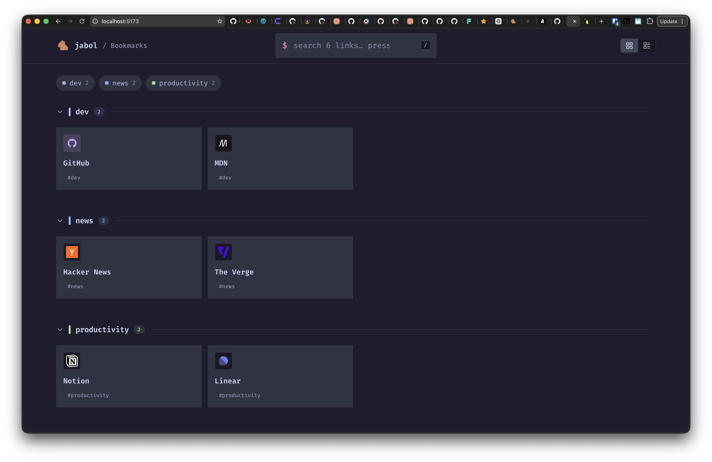

<div align="center">
  

# jabol

\- _Just A Bunch Of Links_ -

Drop a JSON file, run a container, get a fast and searchable link directory. Optional admin auth lets you edit links from a web UI and hide private links behind a sign-in.

**📖 Docs: <https://stephansama.github.io/jabol>**



</div>

## Quick start

```sh
docker run -d \
  -p 8080:8080 \
  -v "$PWD/links.json:/config/links.json" \
  -v "$PWD/data:/data" \
  -e JABOL_AUTH_SECRET="$(openssl rand -hex 32)" \
  stephanrandle/jabol:latest
```

Open <http://localhost:8080>. The first POST to `/api/signup` (or the `/signup` page) creates the admin account; once that's done the signup endpoint disappears.

Prefer env-driven bootstrap? Set `JABOL_ADMIN_EMAIL` and `JABOL_ADMIN_PASSWORD` and the admin is seeded automatically on first boot.

## Deploy with Coolify

[Coolify](https://coolify.io) deploys this from the included Docker Compose file in a couple of clicks.

1. **Coolify → New Resource → Docker Compose** → point it at this repo (or paste the [`docker-compose.yml`](./docker-compose.yml) directly).
2. In the resource's **Environment Variables** tab, set:
   - `JABOL_AUTH_SECRET` — required, long random string. Generate with `openssl rand -hex 32`.
   - `JABOL_BASE_URL` — `https://your-domain.example.com` (the public URL Coolify will route through its proxy).
   - _(optional)_ `JABOL_ADMIN_EMAIL` + `JABOL_ADMIN_PASSWORD` — seed the first admin so you can skip the `/signup` page.
3. **Assign a domain** under **Domains**. Coolify provisions an HTTPS cert via Let's Encrypt and routes traffic through its built-in proxy to the container's port 8080.
4. **Deploy**. Coolify pulls `stephanrandle/jabol:latest` and starts the container. The two named volumes (`jabol_data`, `jabol_config`) are created automatically and persist across redeploys. The image's entrypoint chowns the mounts to the non-root `jabol` user and seeds a starter `links.json` on first boot, so no manual storage setup is needed.
5. **First visit** — go to `/signup` and create the first admin (or sign in with the seeded admin if you set the env vars). Then `/admin` lets you edit links, brand name, favicon, etc. — all writes persist into the `jabol_config` volume.

### Updating

When a new version is published to `stephanrandle/jabol:latest`, click **Redeploy** in Coolify (or wire a Docker Hub webhook to Coolify's deploy webhook for auto-redeploy). The named volumes survive — your admin accounts and links stay put.

### What lives where

| Volume         | Contents                                   | Lose it and…                                              |
| -------------- | ------------------------------------------ | --------------------------------------------------------- |
| `jabol_data`   | `auth.db` (admins, sessions), cached icons | admin accounts vanish; icons re-fetch on next visit       |
| `jabol_config` | `links.json`                               | the link list resets to the starter "Welcome" category    |

## links.json — two shapes

### Categorized

```json
{
  "title": "Homelab",
  "theme": "mocha",
  "categories": [
    {
      "name": "Dev",
      "icon": "mdi:code-tags",
      "links": [
        { "name": "GitHub", "url": "https://github.com", "icon": "mdi:github" },
        {
          "name": "MDN",
          "url": "https://developer.mozilla.org",
          "tags": ["docs"]
        }
      ]
    }
  ]
}
```

### Flat (with optional tag grouping)

```json
{
  "title": "Bookmarks",
  "theme": "latte",
  "groupByTag": true,
  "links": [
    { "name": "GitHub", "url": "https://github.com", "tags": ["dev"] },
    {
      "name": "Hacker News",
      "url": "https://news.ycombinator.com",
      "tags": ["news"]
    }
  ]
}
```

### Top-level fields

| Field         | Type     | Notes                                                                                             |
| ------------- | -------- | ------------------------------------------------------------------------------------------------- |
| `brand`       | `string` | Organization name shown in the top bar and used as the browser tab title. Editable from `/admin`. |
| `title`       | `string` | Collection title shown as a sub-label next to the brand. Editable from `/admin`.                  |
| `description` | `string` | Page description / meta.                                                                          |
| `favicon`     | `string` | URL or `/api/icons/...` path for the favicon. Set via the Branding panel in `/admin`.             |
| `theme`       | `string` | First-time visitor theme: `light` / `dark` / `mocha` / `latte`.                                   |

### Link fields

| Field         | Type       | Notes                                                                                                               |
| ------------- | ---------- | ------------------------------------------------------------------------------------------------------------------- |
| `name`        | `string`   | Required.                                                                                                           |
| `url`         | `string`   | Required, http(s).                                                                                                  |
| `description` | `string`   | Optional, shown under the name.                                                                                     |
| `icon`        | `string`   | Optional Iconify id (e.g. `mdi:github`) or absolute URL. If absent, jabol fetches the page's favicon and caches it. |
| `image`       | `string`   | Optional OG image override. If absent, jabol fetches `og:image`.                                                    |
| `tags`        | `string[]` | Optional, searched and shown as pills.                                                                              |
| `hidden`      | `boolean`  | If `true`, only authenticated admins see the link. Also accepted on a category — hides the whole category and every link inside it. |
| `openInSameTab` | `boolean` | If `true`, the link opens in the current tab. Default opens in a new tab.                                         |

UUIDs are added automatically the first time the file is read so admin edits are addressable.

### Editor autocomplete

Add a `"$schema"` pointer at the top of your file for autocomplete, validation, and hover docs in VS Code (or any JSON Schema-aware editor):

```json
{
  "$schema": "https://raw.githubusercontent.com/stephansama/jabol/refs/heads/main/schema/links.schema.json",
  "title": "Homelab",
  "categories": [...]
}
```

The schema is generated from the same Zod definitions the server uses and committed at [`schema/links.schema.json`](./schema/links.schema.json). Regenerate after editing `server/enrich/schema.ts` with `pnpm schema:generate`.

## Themes

Four themes shipped: `light`, `dark`, `mocha` (Catppuccin Mocha), `latte` (Catppuccin Latte). Choice persists per browser via `localStorage`. The optional top-level `"theme"` field sets the initial theme for first-time visitors only.

## PWA / install

jabol is an installable Progressive Web App. Browsers expose an "Install" / "Add to Home Screen" action that launches it as a standalone app, and a service worker (built with [`vite-plugin-pwa`](https://vite-pwa-org.netlify.app/)) keeps it usable offline:

- **App shell** (JS/CSS/fonts) is precached so the UI loads instantly and offline.
- **Navigations** use a network-first strategy, so the server's per-request `<head>` (title, description, social/OG tags) stays current when online and falls back to the last-seen page when offline.
- **Link data** (`/api/*`) is cached network-first and **cached favicons/OG images** (`/api/icons`) cache-first, so the directory still renders from the last response while offline. SSE (`/api/events`) and auth (`/api/auth`) are never cached.
- When a new version is deployed, a small toast offers to reload into it. The browser/OS chrome color tracks the active theme.

Icons are generated from `assets/favicon.svg` by [`@vite-pwa/assets-generator`](https://vite-pwa-org.netlify.app/assets-generator/); regenerate them with `pnpm assets:generate` (config in `pwa-assets.config.ts`). The service worker is only active in production builds (`pnpm build` / `pnpm start`), not under `pnpm dev`.

## Search & keyboard

| Key       | Action                    |
| --------- | ------------------------- |
| `/`       | Focus the search bar      |
| `↑` / `↓` | Move highlight            |
| `Enter`   | Open the highlighted link |
| `Esc`     | Clear search              |

## Admin

- `/login` — sign in
- `/signup` — only reachable on a fresh install with no admin and no `JABOL_ADMIN_EMAIL` set
- `/admin` — set the organization name + favicon (file upload or URL paste), add/edit/delete links and categories, toggle hidden, manage other admin accounts

Mutations write back to the mounted `links.json` atomically (temp file + rename). If the mount is read-only, the admin UI shows a banner and the write endpoints return 403 — auth still works so admins can sign in to see hidden links.

External edits to `links.json` (e.g. you edit the file by hand) are picked up by a file watcher and pushed to connected clients over SSE.

## Static site generation (SSG)

Don't want to run a server? Generate a fully static site from your `links.json` and host it
anywhere (Netlify, GitHub Pages, S3, a plain CDN):

```sh
npx jabol build --config links.json --out ./site
```

This builds the SPA, embeds your (public) links as the initial payload, fetches favicons/OG
images, and writes `./site` ready to deploy. The output is **presentational only** — no admin,
login, or live updates; it renders entirely from the embedded data and makes zero API calls.

| Flag              | Default          | Purpose                                                            |
| ----------------- | ---------------- | ------------------------------------------------------------------ |
| `-c, --config`    | `./links.json`   | Path to your links JSON (categorized or flat).                     |
| `-o, --out`       | `./site`         | Output directory.                                                  |
| `-b, --base`      | `/`              | Public base path — use e.g. `/repo/` for `user.github.io/repo/`.   |
| `--site-url`      | —                | Absolute URL, written to `og:url`.                                 |
| `--no-enrich`     | (enrich on)      | Skip fetching favicons/OG images (offline, deterministic).         |

Subpath example (GitHub Pages project site):

```sh
npx jabol build --config links.json --out ./site --base /my-links/
```

Hidden links/categories are dropped from static output. Cached icons are written under
`<out>/api/icons/` and referenced with the chosen base.

## Environment

| Var                    | Default                 | Purpose                                             |
| ---------------------- | ----------------------- | --------------------------------------------------- |
| `PORT`                 | `8080`                  | Listen port.                                        |
| `JABOL_BASE_URL`       | `http://localhost:8080` | Used by better-auth for cookie + trusted origins.   |
| `JABOL_CONFIG_PATH`    | `/config/links.json`    | Path to the links JSON.                             |
| `JABOL_DATA_DIR`       | `/data`                 | Writable dir for `auth.db` and `icons/`.            |
| `JABOL_AUTH_SECRET`    | dev-only fallback       | **Set this in production.** Used to sign sessions.  |
| `JABOL_ADMIN_EMAIL`    | —                       | If set with password, seeds an admin on first boot. |
| `JABOL_ADMIN_PASSWORD` | —                       | Paired with `JABOL_ADMIN_EMAIL`. Min 8 chars.       |

## Development

This is a pnpm workspace:

| Package          | What it is                                                              |
| ---------------- | ---------------------------------------------------------------------- |
| `@jabol/core`    | Shared pipeline — normalize, enrich, head-render, canonical types (published). |
| `@jabol/client`  | React SPA (private).                                                    |
| `@jabol/server`  | Hono API + head-injected SPA shell (private).                          |
| `jabol`          | The SSG CLI (published to npm, `bin: jabol`).                          |

```sh
pnpm install
pnpm dev        # builds core, then runs server (:8080) + Vite SPA (:5173, /api proxied)
```

Defaults point at `examples/categorized.json` and `.data/` in the repo root, so no env vars are
needed for a dev run. Override with `JABOL_CONFIG_PATH`, `JABOL_DATA_DIR`, `JABOL_AUTH_SECRET`.
`pnpm build` builds all packages; `pnpm typecheck` / `pnpm test` fan out across the workspace.

## API

| Method | Path                    | Auth  | Notes                                                  |
| ------ | ----------------------- | ----- | ------------------------------------------------------ |
| GET    | `/api/info`             | —     | `{ readOnly, signupOpen, hasAdmin }`                   |
| GET    | `/api/session`          | —     | Current session or `null`.                             |
| GET    | `/api/events`           | —     | Server-Sent Events for `links:update`.                 |
| GET    | `/api/links`            | —     | Canonical JSON minus hidden links.                     |
| GET    | `/api/links/admin`      | admin | Full canonical JSON.                                   |
| POST   | `/api/links/admin`      | admin | `{ categoryId, link }`.                                |
| PATCH  | `/api/links/admin/:id`  | admin | Partial link fields.                                   |
| DELETE | `/api/links/admin/:id`  | admin | Removes the link.                                      |
| POST   | `/api/categories`       | admin | `{ name, icon? }`.                                     |
| PATCH  | `/api/categories/:id`   | admin | Partial.                                               |
| DELETE | `/api/categories/:id`   | admin | 400 if links remain.                                   |
| GET    | `/api/admins`           | admin | List admin users.                                      |
| POST   | `/api/admins`           | admin | `{ email, password }`.                                 |
| DELETE | `/api/admins/:id`       | admin | Cannot remove the only admin.                          |
| PATCH  | `/api/settings`         | admin | `{ brand?, title?, favicon? }` — pass `null` to clear. |
| POST   | `/api/settings/favicon` | admin | Multipart `file` upload OR JSON `{ url }`.             |
| POST   | `/api/signup`           | once  | One-shot; 404s once an admin exists or env vars set.   |
| ANY    | `/api/auth/*`           | —     | better-auth handlers (sign-in, sign-out, session).     |
